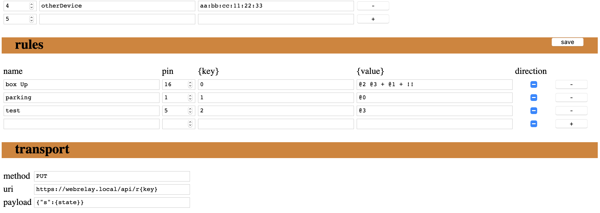

# 📡 WiCheck

Scan device around, then notify a web server or flag a pin.

## Config

- global.timeout: how many time a device can be hidden before WiCheck forgets it
- rules.{key}: parameter replaced into transport.uri and transport.payload
- rules.{value}: parameter replaced into transport.uri and transport.payload (see [Rules](##Rules))
- rules.direction: do the action if the new value is:
    - 'checked': more than the previous one
    - 'indeterminate': not equals the previous one
    - 'unckecked': less than the previous one

## Rules:

The rules used the RPN (Reverse Polish Notation).

Tokens are: 
- {integer}
- '@'{integer}: give the visibility of the device linked by the same ID: 0="not detected", 1="detected"

Operators: 
- 'a b +': `1 2 +` = `3`
- 'a b -': `10 4 -` = `6`
- 'a b *': `5 2 *` = `10`
- 'a b /': `12 3 +` = `4`
- 'a b <': `2 1 <` = `0`
- 'a b =': `9 9 =` = `1`
- 'a b >': `7 5 +` = `1`
- 'then else if ?': `8 3 1 ?` = `8`
- 'a !': `0 !` = `1`

## Start

At the first boot go to `https://wicheck.local/portal` to setup the device, 

Then click on "reboot" and let it works. 
