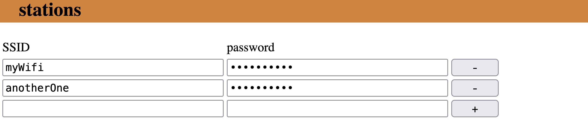

# 📡 WiCheck

Scan device around, then notify a server and/or flag a pin.

## First start

At the first start, join the free "HelloWorld" WiFi. 
The config portal is on `https://{ip}/portal` or  `https://wicheck.local/portal`.

Setup your [config](##Config).

Then click on "reboot" and let it works. 

## Config

### Global

- basicAuth: credentials for accessing to the portal page
- SSID: name and password of the WiFi; when WiCheck can not join a known WiFi it turn itself as an Access Point
- channel: selected channel when WiCheck is an Access Point
- hidden: visibility of the Access Point mode
- timeout: how many time in seconds a device can be hidden before WiCheck forgets it
- auto reboot: reboot WiCheck until a known WiFi is joinned

NB: when a parameter is changed a `save` button appears. 
Click on it for saving... 
It the same behaviours for every config part. 

### Stations

List your friendly WiFi: 

- WiFi credentials where WiCheck will connect

When you add a WiFi, first click on `+` then on the `save` button. 

### Devices

List your friendly devices (even if there are not connected or not on a friendly WiFi): 

- id: keep it unique, there were a reference into the rules
- name: any name for humans
- MAC: stalked MAC address, must use the pattern `aa:aa:aa:aa:aa:aa:aa`

When you add a Device, first click on `+` then on the `save` button. 

### Rules

List your rules, an event is fired as soon as a rule is detected (depending the direction): 

- name: any name for humans
- pin: ESP8266 GPIO number, or set `255` if no pin action is required
    If you use a Wemos Mini D1, D0 is GPIO16, D1 is GPIO5, etc.
- `{key}`: parameter replaced into Transport URI and Transport Payload (cf next section)
- `{value}`: parameter replaced into Transport URI and Transport Payload (cf next section) (see [Grammar](##Grammar))
- direction: do the action if the new value is:
    - 'checked': more than the previous one **onSwitchOn**
    - 'indeterminate': not equals the previous one **onToggle**
    - 'unckecked': less than the previous one **onSwitchOff**

When you add a Rule, first click on `+` then on the `save` button. 

### Transport

Like a webhook, you can define a HTTP request that will be sent for each event defined by Rules. 

- method: HTTP method
- uri: uri of the request, `{key}` and `{value}` are replaced by the value of the verified Rule
- payload: sent content, `{key}` and `{value}` are replaced by the value of the verified Rule

Could be combined to a [webrelay controller](https://github.com/1e1/arduino-webcontroller-relay)

## Grammar:

The rules used the RPN (Reverse Polish Notation).

Tokens are: 
- {integer}
- '@'{integer}: give the visibility of the Device linked by the same ID: 0="not detected", 1="detected"

Operators: 
| OP   	| name             	| syntax               	| type   	| example            	| value     	|
|----	|----------------	|--------------------	|--------	|--------------------	|---------  	|
| `+`  	| addition       	| `a b +`              	| integer	| `1 2 +`            	| `3`       	|
| `-`  	| subtraction    	| `a b -`              	| integer	| `10 4 -`           	| `6`       	|
| `*`  	| multiplication 	| `a b *`              	| integer	| `5 2 *`            	| `10`      	|
| `/`  	| division       	| `dividend divisor /` 	| integer	| `12 3 /`           	| `4`       	|
| `<`  	| less than      	| `left right <`       	| boolean	| `2 1 <`  `2 2 <`     	| `0`  `0`  	|
| `=`  	| equals         	| `a b =`              	| boolean	| `9 9 =`            	| `1`       	|
| `>`  	| more than      	| `left right >`       	| boolean	| `7 1 >`            	| `1`       	|
| `?`  	| if then else   	| `then else if ?`     	| integer	| `7 3 1 ?`  `8 4 0 ?` 	| `7`  `4`  	|
| `!`  	| not            	| `n !`                	| boolean	| `0 !`              	| `1`       	|

### Examples

Switch on a light if any Device is detected: 
- value: `@0 @1 + @2 + @3 +` 
- direction: *checked*

Switch off a light if nobody is detected (or close the shutters): 
- value: `@0 @1 * @2 * @3 *`
- direction: *unchecked*
